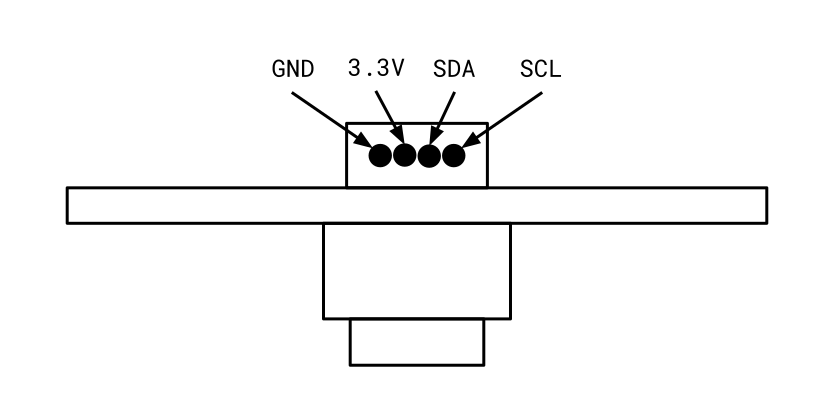
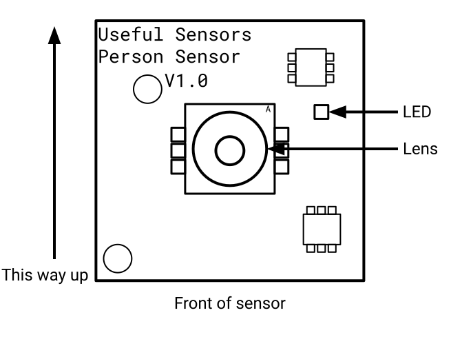
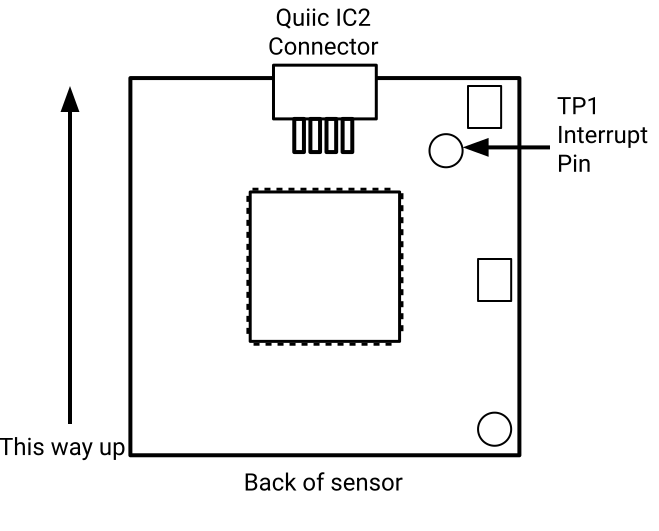
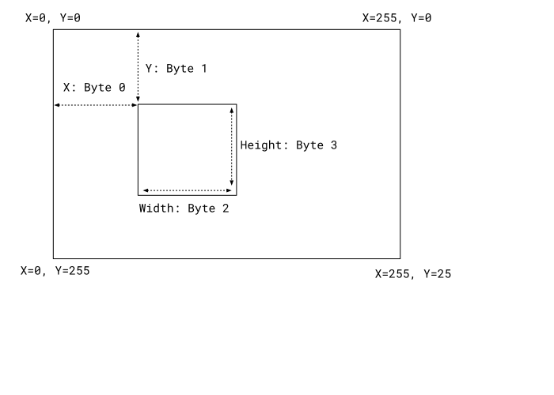

# Person Sensor Developer Guide
*Author [pete@usefulsensors.com](mailto:pete@usefulsensors.com), permanent link is [usfl.ink/ps_dev](https://usfl.ink/ps_dev)*

## Introduction

The [Person Sensor](https://usfl.ink/ps) from [Useful Sensors](https://usefulsensors.com)
is a small, low-cost hardware module that detects nearby peoples’ faces, and
returns information about how many there are, where they are relative to the
device, and performs facial recognition. It is designed to be used as an input
to a larger system, for example to wake up a kiosk display from sleep mode when
somebody approaches, mute a microphone when nobody is present, or orient a fan
so it’s always pointing at the nearest person.

This guide will explain what information the module can return, how to interpret
that information, and how to integrate with a microcontroller like an Arduino or
Raspberry Pi. You will need a basic understanding of electronics, enough to
integrate a temperature sensor for example, but very little coding is required.

  * [Getting it Working](#getting-it-working)
    + [Connecting](#connecting)
    + [Mounting](#mounting)
    + [Powering Up](#powering-up)
    + [Reading Data](#reading-data)
      - [Face Box Location](#face-box-location)
      - [Face Confidence](#face-confidence)
      - [Is Facing](#is-facing)
      - [Identity](#identity)
      - [Identity Confidence](#identity-confidence)
  * [Configuration](#configuration)
  * [Sensor Characteristics](#sensor-characteristics)
  * [Example Code](#example-code)
    + [Useful Sensors Examples](#useful-sensors-examples)
      - [CircuitPython](#circuitpython)
      - [Arduino](#arduino)
      - [Raspberry Pi Pico](#raspberry-pi-pico)
      - [Raspberry Pi](#raspberry-pi)
      - [Micro:bit](#microbit)
    + [Community Examples](#community-examples)
  * [Privacy](#privacy)
  * [Appendix](#appendix)
    + [Data Format](#data-format)
    + [C Struct Format](#c-struct-format)
    + [Python Data Format Strings](#python-data-format-strings)

## Getting it Working

Internally the Person Sensor bundles an image sensor and a small microcontroller
into a single board, but to make it as easy as possible to build into products
we’ve tried to hide those implementation details. We’re hoping that you can
treat the device like you would any other sensor, giving it power and getting
information back through a standard I2C hardware interface.

### Connecting
The board uses a standard Qwiic connector for the I2C interface. This is
designed so you can only plug it in one way, but the individual lines are shown 
in the diagram below for reference. You can find more information about this
form factor at [SparkFun’s Qwiic page](https://www.sparkfun.com/qwiic), but it’s
now widely supported by a lot of vendors, including with [Adafruit’s Stemma QT connector](https://learn.adafruit.com/introducing-adafruit-stemma-qt/what-is-stemma-qt).
SparkFun also have a [guide for connecting to a Raspberry Pi](https://learn.sparkfun.com/tutorials/qwiic-hat-for-raspberry-pi-hookup-guide), 
and [another for Arduino Nanos](https://learn.sparkfun.com/tutorials/sparkfun-qwiic-shield-for-arduino-nano-hookup-guide). If you're using a standard
connector, the wire colors are yellow for SCL, blue for SDA, red for 3.3V, and
black for GND.
There’s also a separate interrupt pin, TP1, which is used to indicate if any 
people have been detected. This is only needed if you want to wake your system
from a sleep mode to save power, otherwise you can ignore it, it just indicates
that there is information to be read. Many applications can just repeatedly poll
the I2C bus. The sensor supports I2C bus speeds of up to 400k baud. We expect
3.3V power, other voltage levels are not supported.



### Mounting

The sensor uses an image sensor internally, so you need to make sure that the
lens has a clear field of view, and that it’s mounted the right way up. You
should be able to see the side of the board that has the sensor by spotting the 
small lens in the center. You’ll know you have it the right way up when the
silkscreen writing “Useful Sensors Person Sensor V1.0”  is at the correct
orientation. The locations of the lens, the I2C connector, and the right way up 
are shown in the diagrams below. 



The camera module can become detached from the board, since the connector is not fixed. You should be able to reconnect it by pressing it firmly back into place. You’ll know you have it at the correct orientation if the small silkscreen ‘A’ is upright in the top right corner of the module.

### Powering Up

Before you start trying to read information from the sensor, a good first step
is to power it up and make sure it seems to be working correctly. To do this
connect the GND and 3.3V lines from your microcontroller to the sensor. If
you’re using a Qwiic socket on the MCU you’ll also be connecting the SDA and SDC
automatically, but if you’re breaking out to individual pins don’t worry about
them yet. With the sensor powered, try moving it around so the camera is pointed
at your face. You should see the LED light up green.

### Reading Data

Once you have the sensor connected and mounted, you’ll want to start reading
information from it. The code you use to do this will depend on the platform
you’re using for the main controller device, but [here’s some C example code for
a Raspberry Pi Pico](https://github.com/usefulsensors/person_sensor_pico_c).
The 7-bit peripheral address for the sensor is 0x62. Please note that some systems
include the read/write bit in the address, making the 8-bit peripheral address 0xC4.

```C
person_sensor_results_t results = {};
while (1) {
  // Perform a read action on the I2C address of the sensor to get the
  // current face information detected.
  if (!person_sensor_read(&results)) {
    printf("No person sensor results found on the i2c bus\n");
    sleep_ms(SAMPLE_DELAY_MS);
    continue;
  }

  printf("********\n");
  printf("%d faces found\n", results.num_faces);
  for (int i = 0; i < results.num_faces; ++i) {
    const person_sensor_face_t* face = &results.faces[i];
    printf("Face #%d: %d confidence, (%d, %d), %dx%d, %s\n",
      i, face->box_confidence, face->box_left, face->box_top,
      face->box_right, face->box_bottom, 
      face->is_facing ? "facing" : "not facing");
  }
  sleep_ms(SAMPLE_DELAY_MS);
}
```

In its simplest form, this shows how you read data from the peripheral. That data contains information about all faces that the sensor has detected, with information about their 2D location in the frame, the amount of confidence that we really have detected a face, whether the face was looking directly at the sensor,  the identity of the face, and our confidence in that identification.

#### Face Box Location

The bounding box around the face is stored as four bytes in an array. All the
values are from 0 to 255, representing the relative position or size within the
field of view. Only the two-dimensional coordinates of the face within the view
are returned, but the size of the bounding box can be used as an approximation
of the distance. 



#### Face Confidence

The face (or bounding box) confidence reflects how certain the sensor is that
what it has found is actually a face, and not just [a funny pattern on a piece of toast](https://www.buzzfeed.com/arielknutson/people-who-found-jesus-in-their-food).
The value will range from zero, least certain, to one hundred, most certain, and is
stored as a single byte value. You can use this to adjust your application’s
behavior if you require more certainty to take a particular action.

#### Is Facing

Set to true if the face is pointing directly at the camera. We only use the
pose of the head to determine this, so a person's eyes may still be looking
away.

#### Identity

The identity part of the interface is probably the most confusing feature this
sensor offers. Our goal is to be able to allow systems to personalize their
responses to different users, for example a coffee machine could remember 
someone's favorite order and have it ready to go when they walk up to it.
However, we don’t want to expose any biometric information for privacy reasons, 
since your face is like a web cookie that you can never clear. With that in
mind, we have adopted an approach where we assign an arbitrary ID from 0 to 7
to a recognized person, and try to recall that same ID when we see them again.
In the future we hope to do the initial assignment automatically when we see a
new person, but for this version we ask that the controlling system triggers a
“calibration” process when the developer knows a new person is present.

By default, the sensor will not run any recognition until calibration has been
performed. After at least one person has been calibrated, the sensor will always
run recognition on the largest face present, and assign an ID number if it’s
recognized as one that it has been calibrated on. If no face is recognized, the
ID confidence will be zero or less.

The facial recognition system is still experimental, and works most reliably
when the face is straight on to the sensor. It will also be lower accuracy if
somebody has their face obscured, for example with a mask. You can use the
`is_facing` attribute of the returned face data to tell if somebody is looking
directly at the device. You shouldn’t rely on the facial identification results
as a sole security factor, since it’s not designed to be that accurate. It’s
intended for less safety-critical applications like personalizing a user
experience automatically, where the cost of mistakes is lower. 

The mapping of an ID to a particular person is lost by default when power is cut
off to the sensor, but you can store this information persistently using a
configuration option.

#### Identity Confidence

Similar to the bounding box confidence, the identity confidence is a single byte
value from zero to one hundred that represents how confident the sensor is in a
particular identification result.

## Configuration
We’ve tried to make the default behavior of the system as easy to get started with as possible, but there are some options that may be helpful to optimize the performance or power usage of the system. You can apply these configuration changes by writing a byte for the register address, followed by a byte for the value, into the I2C bus to the peripheral ID.

| Address | Name | Default | Description |
| ------- | ---- | ------- | ----------- |
| 0x01 | Mode | 0x01 (continuous) | Mode. See mode table below. |
| 0x02 | Enable ID | 0x00 (False) | Enable / Disable the ID model. With this flag set to False, only capture bounding boxes. |
| 0x03 | Single shot | 0x00 | Trigger a single-shot inference. Only works if the sensor is in standby mode.|
| 0x04 |Label next ID | 0x00 |Calibrate the next identified frame as person N, from 0 to 7. If two frames pass with no person, this label is discarded. |
| 0x05 | Persist IDs | 0x01 (True) | Store any recognized IDs even when unpowered. |
| 0x06 | Erase IDs | 0x0 | Wipe any recognized IDs from storage. |
| 0x07 | Debug Mode | 0x01 (True)| Whether to enable the LED indicator on the sensor. |

| Mode | Name | Description |
| ---- | ---- | ----------- |
| 0x00 | Standby | Lowest power mode, sensor is in standby and not capturing. |
| 0x01 | Continuous | Capture continuously, setting the GPIO trigger pin to high if a face is detected. |

## Sensor Characteristics

The module relies on an image sensor and computer vision to detect faces, so it
does require some illumination to work. We have picked a sensor that seems to
work well even in dim conditions, though we don’t have detailed information on
how the performance varies with lumens. We have [a bug pending](https://github.com/usefulsensors/ID-Demo/issues/3)
on collecting that data.

The image sensor doesn’t include an IR filter, so using near-IR illumination
from an LED should be possible in situations where visible light is not
available, but we haven’t characterized the accuracy of the sensor in those
conditions.

The sensor has approximately a 110 degree field of view.

The model runs about seven times a second when no facial recognition is being
performed, and roughly five times a second if it has been enabled. The latency
is approximately the time to perform one model iteration, so roughly
200 milliseconds.

This version of the board requires 3.3V input, and consumes about 150 milliwatts
of power (with about 5mW going to the LED when active). The power consumption is
higher than we would like, so we’re hoping to reduce this significantly in future
versions of the hardware. Part of the issue is that some of the components
operate on 0.9V and 1.8V, so we’re losing a substantial amount of power in the
conversion.

## Example Code

### Useful Sensors Examples

We have written samples for some of the most popular development platforms.

#### CircuitPython

[github.com/usefulsensors/person_sensor_circuit_python](https://github.com/usefulsensors/person_sensor_circuit_python)

[github.com/usefulsensors/person_sensor_screen_lock](https://github.com/usefulsensors/person_sensor_screen_lock)

[github.com/usefulsensors/person_sensor_carousel](https://github.com/usefulsensors/person_sensor_carousel)

[github.com/usefulsensors/person_sensor_eye](https://github.com/usefulsensors/person_sensor_eye)

#### Arduino

[github.com/usefulsensors/person_sensor_arduino](https://github.com/usefulsensors/person_sensor_arduino)

[github.com/usefulsensors/person_sensor_tv_remote](https://github.com/usefulsensors/person_sensor_tv_remote)

#### Raspberry Pi Pico

[github.com/usefulsensors/person_sensor_pico_c](https://github.com/usefulsensors/person_sensor_pico_c)

#### Raspberry Pi

[github.com/usefulsensors/person_sensor_rpi_python](https://github.com/usefulsensors/person_sensor_rpi_python)

#### Micro:bit

[github.com/usefulsensors/person_sensor_micro_bit](https://github.com/usefulsensors/person_sensor_micro_bit)

[github.com/usefulsensors/person_sensor_cutebot](https://github.com/usefulsensors/person_sensor_cutebot)

### Community Examples

We also love to feature projects created by makers, so if you'd like to see your
guide, tutorial, or GitHub repo featured here, please send us a pull request
adding it to this section of the documentation. We also collect maker guides at
[our Hackster project hub](https://www.hackster.io/useful-sensors/projects).

#### Arduino

[github.com/robotastic/useful-autolock](https://github.com/robotastic/useful-autolock)

#### ESP32

[github.com/shreyaskarnik/esphome-components](https://github.com/shreyaskarnik/esphome-components)

#### Pico

[instructables.com/Facial-Recognition-Using-the-Person-Sensor-and-Pic/](https://www.instructables.com/Facial-Recognition-Using-the-Person-Sensor-and-Pic/)

## Privacy
This module includes an image sensor, and we want to make sure that this doesn’t
pose a threat to any of our users’ privacy. We’ve designed the module so that it
is as resistant as possible to anyone accessing the raw image data, and only the
metadata derived from each frame is available. We’ve also built it to have as
slim an interface as possible, to reduce the possibility of malicious
interference and make it simpler for third parties to audit our privacy claims.

This approach does constrain what developers can do with the device. One obvious
restriction is that we don’t allow you to access the image data, but we also
don’t support flashing the firmware or model updating, because doing so could
allow unchecked changes to the sensor’s behavior. Even though there’s a
microcontroller on the board, we’re hoping that you’ll be able to get enough
value out of its pre-programmed behavior to compensate for the inconvenience of 
this user protection approach.

If you’re interested in learning more about this approach to system design, we
have a [research paper describing what we call Machine Learning Sensors](https://arxiv.org/pdf/2206.03266.pdf).

## Appendix

### Data Format

The inference result is stored as an array of bytes in the following format.
Information about each member is described in detail above.

| Byte Offset | Meaning |
| ----------- | ------- |
| 0 | Reserved |
| 1 | Reserved |
| 2 | Data Length (first byte) |
| 3 | Data Length (second byte) |
| 4 | Number of Faces |
| 5 | Face #0 Box Confidence |
| 6 | Face #0 Box Left |
| 7 | Face #0 Box Top |
| 8 | Face #0 Box Right |
| 9 | Face #0 Box Bottom |
| 10 | Face #0 Recognition Confidence |
| 11 | Face #0 Recognition ID |
| 12 | Face #0 Is Looking At |
| 13 | Face #1 Box Confidence |
| 14 | Face #1 Box Left |
| 15 | Face #1 Box Top |
| 16 | Face #1 Box Right |
| 17 | Face #1 Box Bottom |
| 18 | Face #1 Recognition Confidence |
| 19 | Face #1 Recognition ID |
| 20 | Face #1 Is Looking At |
| 21 | Face #2 Box Confidence |
| 22 | Face #2 Box Left |
| 23 | Face #2 Box Top |
| 24 | Face #2 Box Right |
| 25 | Face #2 Box Bottom |
| 26 | Face #2 Recognition Confidence |
| 27 | Face #2 Recognition ID |
| 28 | Face #2 Is Looking At |
| 29 | Face #3 Box Confidence |
| 30 | Face #3 Box Left |
| 31 | Face #3 Box Top |
| 32 | Face #3 Box Right |
| 33 | Face #3 Box Bottom |
| 34 | Face #3 Recognition Confidence |
| 35 | Face #3 Recognition ID |
| 36 | Face #3 Is Looking At |
| 37 | Checksum (first byte) |
| 38 | Checksum (second byte) |

### C Struct Format

The most up to date versions of these data structures can be found at [github.com/usefulsensors/person_sensor_pico_c/blob/main/person_sensor.h](github.com/usefulsensors/person_sensor_pico_c/blob/main/person_sensor.h), 
but for reference here is a C struct version of the data format. The
non-standard but commonly supported `packed` attribute is used to ensure no
extra padding is introduced.

```C
typedef struct __attribute__ ((__packed__)) {
    uint8_t reserved[2];
    uint16_t data_size; 
} person_sensor_results_header_t;

typedef struct __attribute__ ((__packed__)) {
    uint8_t box_confidence;
    uint8_t box_left;
    uint8_t box_top;
    uint8_t box_width;
    uint8_t box_height;
    int8_t id_confidence;
    int8_t id;
    uint8_t is_facing;
} person_sensor_face_t;

typedef struct __attribute__ ((__packed__)) {
    person_sensor_results_header_t header;
    int8_t num_faces;
    person_sensor_face_t faces[4];
    uint16_t checksum;
} person_sensor_results_t;
```

### Python Data Format Strings

A complete CircuitPython example of decoding the sensor data can be found at [github.com/usefulsensors/person_sensor_circuit_python/blob/main/code.py](github.com/usefulsensors/person_sensor_circuit_python/blob/main/code.py),
but the format strings for struct decoding can be summarized as:

```Python
PERSON_SENSOR_I2C_HEADER_FORMAT = "BBH"
PERSON_SENSOR_FACE_FORMAT = "BBBBBBbB"
PERSON_SENSOR_RESULT_FORMAT = PERSON_SENSOR_I2C_HEADER_FORMAT +
    "B" + PERSON_SENSOR_FACE_FORMAT * 4 + "H"
```
